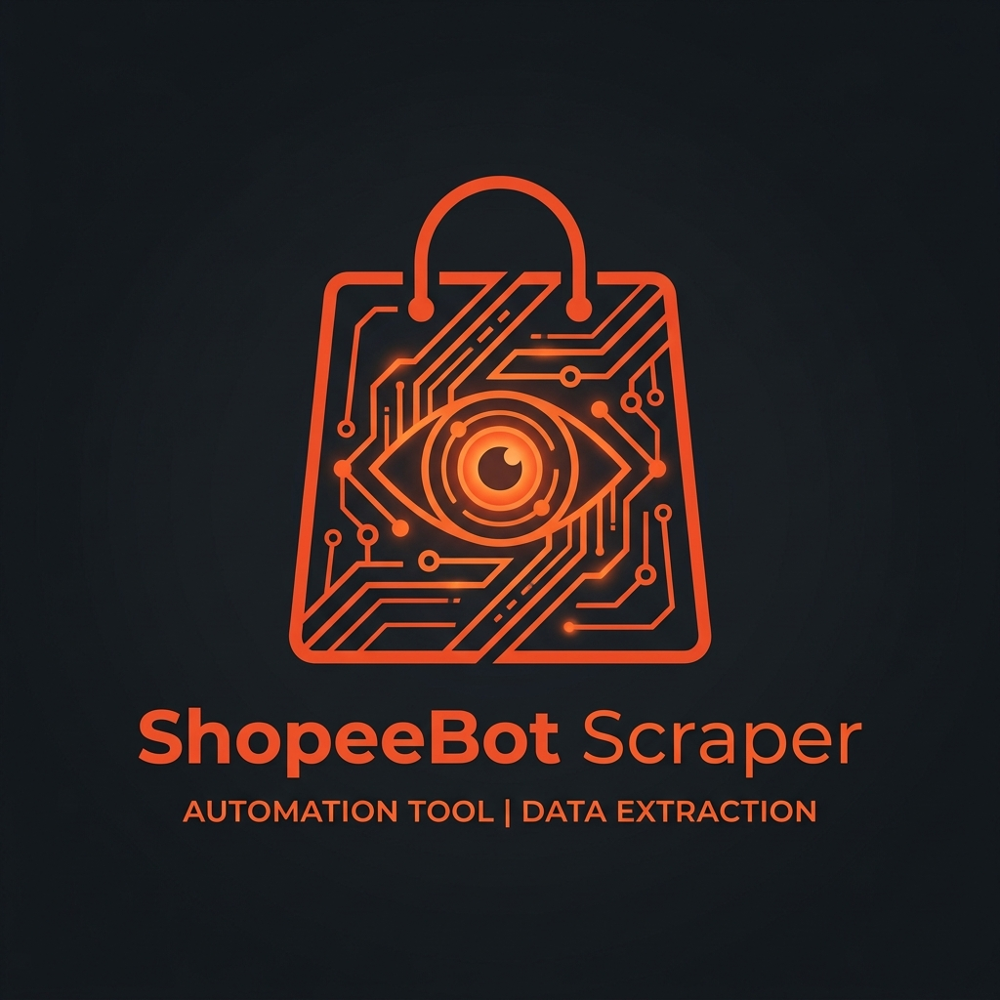

# 🛍️ ShopeeBot Scraper

ShopeeBot Scraper adalah sebuah alat otomatisasi (Automation Tool) berbasis Python untuk melakukan scraping produk, mengumpulkan data spesifikasi, serta mengirimkan pesan massal (broadcast) kepada penjual (seller) di platform Shopee.

Bot ini dilengkapi dengan antarmuka terminal interaktif yang sangat mudah digunakan, serta memiliki kemampuan anti-bot/stealth melalui pengontrolan browser secara *real-time* (menggunakan Playwright).

---

## 🌟 Fitur Utama

1. **Scrape Links (Pencari Link Produk)** 🔍
   - Pencarian berdasarkan **Keyword** (kata kunci) atau spesifik **Toko** (username/URL toko).
   - Pengurutan hasil berdasarkan Relevansi, Terbaru, Terlaris, atau Harga.
   - Filter **Lokasi Penjual** secara presisi.
   - Filter **Minimum Rating** produk.
   - Manajemen kategori penyimpanan tabel data (otomatis tersimpan ke `shopee_links.csv`).

2. **Scrape Produk (Pengambil Detail Produk)** 📦
   - Otomatis membuka URL produk yang belum diproses dari file CSV.
   - Menyimpan seluruh informasi penting seperti Judul, Harga, Deskripsi, dan Spesifikasi lengkap.
   - Mampu mengekstrak **semua variasi** beserta harga masing-masing.
   - Mendeteksi dan mencocokkan secara otomatis **Kode Kategori** Shopee (berdasarkan referensi `Kode_Kategori.xlsx`).
   - Mengunduh otomatis **gambar aseli/resolusi tinggi** dari produk (tanpa watermark).
   - Seluruh data diekstrak rapih ke dalam format file Markdown (`.md`).

3. **Preview Hasil & Ekspor Excel (Dashboard Interaktif)** 📊
   - Melihat seluruh hasil scraping Anda dalam bentuk dashboard website yang modern dan interaktif.
   - Mengatur persentase kenaikan **Harga Upload** secara dinamis (contoh: +20%) langsung dari antarmuka web.
   - Mengekspor langsung produk ke dalam format `.xlsx` (menggunakan susunan `Template.xlsx`) yang langsung siap di-upload (Mass Upload) ke Shopee.

4. **Update Produk (Re-scrape)** 🔄
   - Memperbarui data produk yang sebelumnya sudah pernah di-scrape (berguna saat ada perubahan harga di toko sumber atau update fitur scraper).
   - Tanpa harus memisahkan file CSV, bot cerdas memilih ulang produk yang sebelumnya berstatus *Done*.

5. **Send Message (Pengirim Pesan Otomatis)** ✉️
   - Kirim *Automated Chat* kepada penjual dari daftar link produk (misal: penawaran afiliasi/dropship).
   - Smart Filtering: Hanya mengirim 1 kali pesan untuk penjual yang sama (menggunakan ID Toko).
   - Support seleksi data berdasarkan Keyword atau Kategori.
   - Jeda interaksi cerdas (*randomized delay*) untuk meminimalisasi deteksi spamming oleh Shopee.

---

## 🛠️ Persyaratan Sistem

- Sistem Operasi: Windows, macOS, atau Linux
- [Python 3.8+](https://www.python.org/downloads/)
- Google Chrome terinstal di perangkat.

---

## ⚙️ Instalasi

### 📦 Instalasi via Package Debian (.deb) - Rekomendasi untuk Ubuntu/Debian
Jika Anda menggunakan sistem operasi berbasis Debian (seperti Ubuntu, Linux Mint, Kali Linux, dll), cara termudah dan terekomendasi adalah menggunakan file instalasi `.deb`. Seluruh konfigurasi (termasuk Virtual Environment, dependensi Python, Node.js, dan akses _database_) akan diatur secara otomatis ke dalam `/opt/shopeebot`.

1. **Download file `.deb` terbaru** dari *Releases* di repositori ini (atau temukan file `shopeebot_1.0.1-beta_amd64.deb` di direktori *project* lokal Anda).
2. **Install package menggunakan `apt` atau `dpkg`**:
   ```bash
   sudo apt update
   sudo dpkg -i shopeebot_1.0.1-beta_amd64.deb
   
   # Jika muncul error karena dependensi sistem yang belum lengkap, jalankan:
   sudo apt --fix-broken install
   ```
3. Selesai! Anda sekarang dapat membuka aplikasinya langsung dari menu aplikasi (Application Menu/App Drawer) di Desktop Anda dengan mencari **ShopeeBot Pro**, atau dengan menjalankan perintah `shopeebot` di terminal kapan saja.

---

### 🐧 Khusus Linux (Paling Cepat)
Jika Anda menggunakan Linux, Anda bisa menggunakan launcher otomatis yang akan menyiapkan segalanya untuk Anda:
```bash
chmod +x shopeeBot.sh
./shopeeBot.sh
```

### 🪟 Cara Manual (Windows/macOS/Linux)
1. **Clone repositori ini:**
   ```bash
   git clone https://github.com/djrecycle/shopeeBot.git
   cd shopeeBot
   ```

2. **Buat dan aktifkan virtual environment:**
   ```bash
   # Di Linux / macOS
   python3 -m venv shopee-venv
   source shopee-venv/bin/activate

   # Di Windows
   python -m venv shopee-venv
   .\shopee-venv\Scripts\activate
   ```

3. **Install dependensi & Browser:**
   ```bash
   pip install -r requirements.txt
   playwright install chromium
   ```

---

## 🚀 Cara Penggunaan

Penggunaan bot ini sekarang jauh lebih gampang dan modern berkat antarmuka grafis (GUI) terbaru.

**Untuk Linux:**
Cukup jalankan launcher:
```bash
./shopeeBot.sh
```

**Untuk Umum (Terminal):**
Pastikan virtual environment telah aktif, lalu jalankan perintah ini:
```bash
# Aktifkan virtual environment (Linux/macOS)
source shopee-venv/bin/activate

# Jalankan aplikasi
python gui_main.py
```

Anda akan melihat tampilan **ShopeeBot Automation Control Panel** yang elegan dengan welcome screen seperti ini di Console:

```text
=======================================================
███████╗██╗  ██╗ ██████╗ ██████╗ ███████╗███████╗
██╔════╝██║  ██║██╔═══██╗██╔══██╗██╔════╝██╔════╝
███████╗███████║██║   ██║██████╔╝█████╗  █████╗  
|════██║██╔══██║██║   ██║██╔═══╝ ██╔══╝  ██╔══╝  
███████║██║  ██║╚██████╔╝██║     ███████╗███████╗
╚══════╝╚═╝  ╚═╝ ╚═════╝ ╚═╝     ╚══════╝╚══════╝
                  BOT SCRAPER LAUNCHER v1.0.1-beta             
=======================================================
        All-in-One Automation Tools for Shopee         
=======================================================
```

**Navigasi Menu Sidebar:**
- **🏠 Dashboard**: Pusat kendali utama Anda. Dari sini Anda bisa mengatur *Keyword*, *Kategori*, dan jumlah halaman, lalu menjalankan berbagai tugas:
  - **🔑 Login**: Buka browser khusus bot untuk login ke akun Shopee Anda secara manual agar sesi/cookie tersimpan (Sangat Disarankan).
  - **🔗 Link Scraper**: Cari dan kumpulkan ratusan link produk berdasarkan target keyword/toko ke dalam database.
  - **📦 Product Scraper**: Buka jendela konfigurasi tingkat lanjut untuk mengekstrak detail produk (judul, variasi, harga, gambar) dari link yang sudah dikumpulkan. Mendukung filter bertingkat berdasarkan Kategori dan Keyword.
  - **💬 Messenger**: Kirim pesan massal (broadcast) promo/afiliasi kepada penjual.
- **📊 Lihat Database**: Tampilan tabel interaktif untuk memonitor, mengurutkan, dan menghapus data link yang ada di `shopee_links.csv`. Menampilkan nama Toko dan status scrape secara *real-time*.
- **🌐 Generate Site**: Hasilkan dan buka langsung dashboard *Preview Hasil* berwujud website lokal yang keren. Di web ini Anda bisa menyesuaikan persentase Harga Upload dan mendownloadnya dalam bentuk `.xlsx`.
- **📂 Manajer File MD**: Jelajahi, baca, dan kelola file-file Markdown berisi data detail tiap produk yang sudah berhasil di-scrape tanpa perlu repot membuka file manager bawaan OS.

───────────────────────────────────────────────────────

## 📂 Struktur File dan Folder

Setelah dijalankan, skrip secara otomatis akan membuat file dan struktur folder berikut:

- `shopee_links.csv` — File inti untuk menyimpan database pencarian Anda. (Termasuk Status Scrape dan Status Chat).
- `Kode_Kategori.xlsx` — (Disediakan) Basis data referensi nama kategori ke kode angka unik kategori Shopee.
- `Template.xlsx` — (Disediakan) Template master Shopee yang menjadi dasar format hasil file ekspor `.xlsx`.
- `hasil_md/` — Folder tempat di mana hasil kompilasi detail setiap produk (dalam format Markdown/MD) akan disimpan.
- `gambar/` — Folder unduhan galeri serta variasi foto alat produk Anda.
- `shopee_debug_profile/` — Ini akan dibuat secara independen oleh Google Chrome untuk menyimpan cookie session Anda *(Ini diabaikan di .gitignore agar tidak ter-upload tanpa disengaja)*.

---

## ⚠️ Peringatan Penting & Troubleshooting!

1. **Pemblokiran / Captcha**: Antivirus bawaan Shopee (Datadome/Traffic Error) kemungkinan besar akan muncul mendeteksi bot Anda.
   - **Solusi**: Biarkan jendela Chromium terbuka, selesaikan slide verifikasi (Captcha) atau Log-in di jendela tersebut secara manual, lalu tekan `ENTER` pada terminal untuk mengizinkan bot melanjutkan pekerjaannya kembali. Poses *session* ini akan otomatis selalu disimpan oleh bot.

2. **Deteksi Spam / Ratelimit**: Jangan menjalankan bot terlalu barbar / kencang dengan mematikan randomized delay di dalam source code, ini akan membahayakan akun Shopee Anda (Shadow-banned). Gunakan jeda secukupnya yang sudah tertulis di dalam `send_message.py` dan biasakan memproses dalam beberapa iterasi data saja contohnya per 5 batch.

---

## 📜 Lisensi
Sistem scraper ini dikembangkan sebagai alat bantu pribadi/edukasional semata. Harap mematuhi aturan dan pedoman interaksi Term of Service (TOS) yang diatur oleh Shopee Indonesia. Tanggung jawab penggunaan kembali sepenuhnya ditanggung oleh pengguna yang memodifikasi sistem ini.
